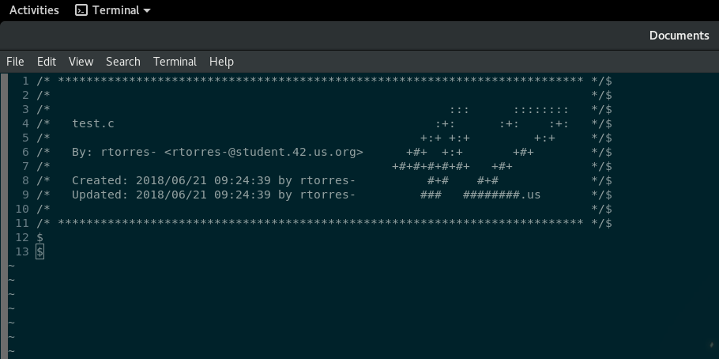

# 42_Stdheader_Vim
Your own vim header for 42 projects

## Features
* Passes `norminette`
* Elegant trimming of long strings
* Updates filename line when changed
* Updates "Updated" line only when buffer is changed
* Works with all formats that default supports
* Binds to `F1` for easy access
* Overrides `:Stdheader` for school vim installs

Also, don't forget to set your `$USER` and `$MAIL` variables, marvin lives!
> You can take as a reference how I setup my variables
[here](https://github.com/idevHive/Settings/blob/master/dotfiles/Bash/Fedora/.bash/.bash_exports).

## Usage
Copy `42_Stdheader.vim` to your `~/.vim/plugin` folder. You're set!
